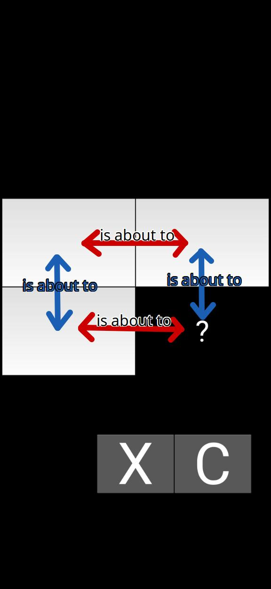
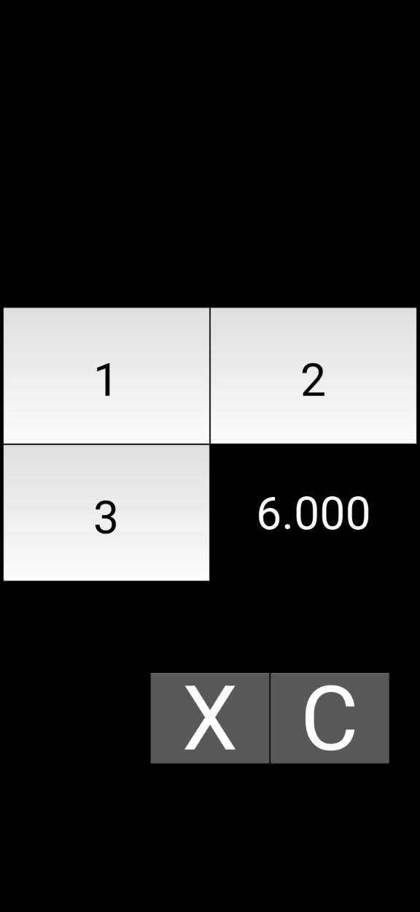

# mercalculator

Proportionality constant calculator, i.e. rule of three. Useful for checking cheaper and more viable products on the market, for example.





Installing (only Android)
---

To install the app in your phone, you must

1. Acess the project [releases](https://github.com/gabrielproencaalves/mercalculator/releases).
1. Download the available .apk.
1. Install it on your device.

For now, the attached apk is only intended for Android with armv8, armv7, x86 or x86_64 architecture hardware. Additionally, there are no versions available for iOS at this time.

Testing (on desktop)
---

### Requirements

Before any test, make sure you have the necessary programs on your computer to run the app. And these programs are

- [Python3](https://python.org/).
- [Kivy](https://kivy.org/doc/stable/gettingstarted/installation.html#using-pip).

### Running

With the requirements, dependencies properly installed, and a python virtual environment in progress, run

```
(kivy_env) $ python3 main.py
```

and the app will open on your desktop.

How to contribute
---

If you want to contribute to the project, please share it, as this will give other people the opportunity to use this app in their daily lives. Additionally, if this app helped you save money, please donate some to this project. This way, you will allow its author to create more free, libre and useful tools like this.

### PIX (Brazil only)


